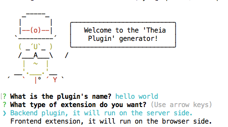
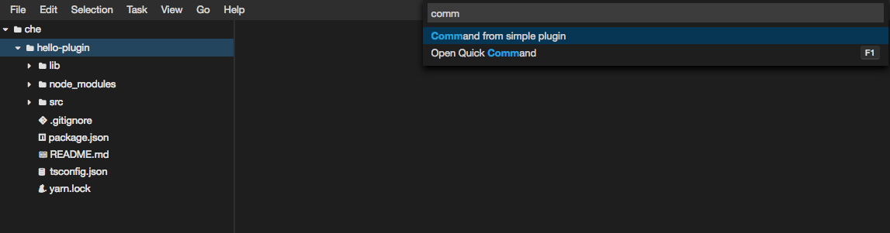

= Developing a Che Plugin documentation

Florent BENOIT <fbenoit@redhat.com>
v0.1, 2018-06-14

:toc:
:icons: font

== Developing a Che Plugin

Overview: Introduction to the extensibility of Eclipse Che
~~~~~~~~~~~~~~~~~~~~~~~~~~~~~~~~~~~~~~~~~~~~~~~~~~~~~~~~~~~

Eclipse Che is cloud-ready with portable workspaces. Then it's quite easy to make it extensible and there are several ways to extend Che.

- Frontend or IDE that is running in your web browser can be extended dynamically by installing set of plug-ins.
An example may be to update the status bar with the local time of your computer so everything need to run on the client's side.

- Server-side of the IDE can also be extended dynamically.
  For example, let say you want to create a plug-in that will replace a given string by another one on all the files of your workspace. Then, it's easy to register a server-side command that will do the job and you'll invoke the command with the command palette of the IDE. The server-side of the IDE using TypeScript/nodejs you've access to all these APIs easily.

- Custom container. Let say you've a very handy docker image that is booting up your server coded using the last hype (or a very old) technology. Idea is to bring that container into the Eclipse Che workspace and then invoke commands on this server. As Che is container native, it's transparent to do that. It would have been more difficult without container approach as all required dependencies would have been installed on the runtime environment. Let say you need a Java JVM, with a container you're sure to provide the same runtime environment to all people. While if you rely on what is available on the current host, you may have issues like old version of Java or too recent version of Java already installed, etc.

Che is composed of client side and server side components.

When developing an IDE plugin, you have the same model available on client side and server side.

Let's consider to register a command's callback like `console.log('foobar')` with a label `Display foo` for the command name.
In all cases, you'll see the command in the command palette which is on the browser's side but the callback is executed either on frontend/browser or the backend/nodejs depending on the type of the plugin.

If the IDE plugin is a frontend plugin, you'll see that trace on the browser web console while if the plugin is a backend plugin you'll see the trace in the logs of the IDE server.

_Note that writing backend extensions allow to use the full nodejs model while with frontend plugins, only a subset is available (web worker model)._

TODO: Add diagram

Plugin Generator: How to use the plugin generator to scaffold a plugin
~~~~~~~~~~~~~~~~~~~~~~~~~~~~~~~~~~~~~~~~~~~~~~~~~~~~~~~~~~~~~~~~~~~~~~~

Creating a scratch might be quite complicated as many files are required. By using a plugin generator, a plugin can be generated easily to scaffold your new idea of plug-in.
The generator is using http://yeoman.io/[Yeoman] tool.

Che generator can be installed by using the following command

 $ npm install -g yo @wiptheia/generator-theia-plugin

 
_Note: yo may be removed if already installed._

Once the generator is setup, a new project can be generated using the following command:

 $ yo @wiptheia/theia-plugin

Developing a Plug-in: How to use Che to implement and run it
~~~~~~~~~~~~~~~~~~~~~~~~~~~~~~~~~~~~~~~~~~~~~~~~~~~~~~~~~~~~~

There is a special Che's stack to create a workspace with a `Hosted Mode`.
Let's use this stack and then you'll have a workspace ready-to-go for developping a new IDE plugin.

If Che is not installed on your computer, there is an online factory that will create the expected workspace on demand.
https://che.openshift.io/f?name=theia-demo.2018051&user=fbenoit-1[Online Workspace to experiment Che plug-ins.]

Once the workspace is created, the command used in the previous section to scaffold a project can be used directly. The generator is already installed in the running container.

 $ yo @wiptheia/theia-plugin

__note:__ the terminal can be found in New terminal menu

Running the plug-in
~~~~~~~~~~~~~~~~~~~

Once a IDE plug-in has been added on the current workspace, it's very easy to try out this plug-in.

Call the command palette and then hosted mode can be started.
The command palette is available by pressing `F1` key on the IDE.

The command to use is
`Hosted Plugin: Start Instance``

The plug-in path will have to be selected. (If you've several plug-in projects in the current workspace, the plug-in that will be deployed needs to be selected)

Once a new instance is started, the browser will open a new tab with a new instance of the IDE with the selected plugin installed on it.

So in the first tab, plug-in can be developed and in the second tab (the other IDE instance) the plug-in is available and can be tested.

Hosted mode can be turned off by selecting
`Hosted Plugin: Stop Instance` in the command palette.

The plug-in is now live. The plug-in has been successfully deployed in the hosted instance.

My first IDE plugin: Hello World plugin
~~~~~~~~~~~~~~~~~~~~~~~~~~~~~~~~~~~~~~~~

Let's create our first plugin. This plugin will display a message "hello world" inside the IDE when we call a command from the command palette.

Goal: Have `Hello World` in the dropdown of the command palette

and when clicking on the command, Hello World notification appears.

In this Hello World plugin, the backend model will be used to illustrate that a command will be displayed in the IDE on the client side (browser) but the callback of that command will be executed on the server side of the plugin that will send the notification to be displayed on the IDE with a very simple API.

First, let's generate the plugin in a directory

 $ mkdir hello-world
 $ cd hello-world
 $ yo @wiptheia/theia-plugin

now there is a plugin ready-to-use in `hello-world` folder.

The typescript source code entrypoint of the plugin is src/hello-world-backend-plugin.ts 

[source,java]
----
import * as theia from '@wiptheia/plugin';

export function start() {
    const command: theia.Command = {
        id: 'hello-world-command',
        label: 'Hello World'
    };
    theia.commands.registerCommand(command, (...args: any[]) => {
        theia.window.showInformationMessage('Hello World');
    });
}
----

When the plug-in is loaded in Che, it will call the `start()` function.

Then, it will register a new command with label `Hello World` and the callback is calling the `theia.window` object with an information message 'Hello World'

So in the UI of the IDE, when asking the command palette, `Hello World` will be displayed. When the command is called, it will execute the callback on a nodejs instance. And then this instance is sending a message to the IDE UI to display a notification message.

The `theia` object is the entry point to the whole API.

One other important file generated by yeoman tool is the `package.json` file.
It's the well known file when using javascript projects.

[source,json]
----
{
      "name": "hello-world-plugin",   // <-- name of the plugin
      "version": "0.0.1",             // <-- version of the plugin
      "files": [
        "src"
      ],
      "devDependencies": {
        "@wiptheia/plugin": "latest",  // <-- dependency to use theia object
        "rimraf": "^2.6.2",
        "typescript": "^2.8.1"
      },
      "scripts": {  // <-- commands to clean and build the project
        "prepare": "yarn run clean && yarn run build",
        "clean": "rimraf lib",
        "build": "tsc"
      },
      "engines": { // <-- mandatory to deploy this plugin on Che.
        "theiaPlugin": "latest"
      },
      "theiaPlugin": { // <-- mandatory as well and specify file entrypoint
            "backend": "lib/hello-world-backend-plugin.js"
      } 
}
----

TODO: link to the theia entrypoint.

Convert VsCode extension
~~~~~~~~~~~~~~~~~~~~~~~~

Ideally, we should also be providing guidance on how a "VS Code extension" could be provided onto Eclipse Che.
